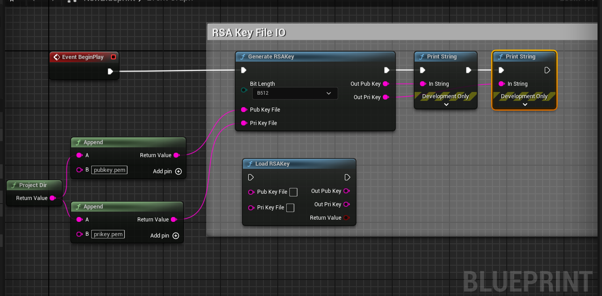
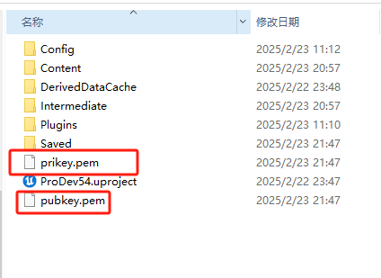
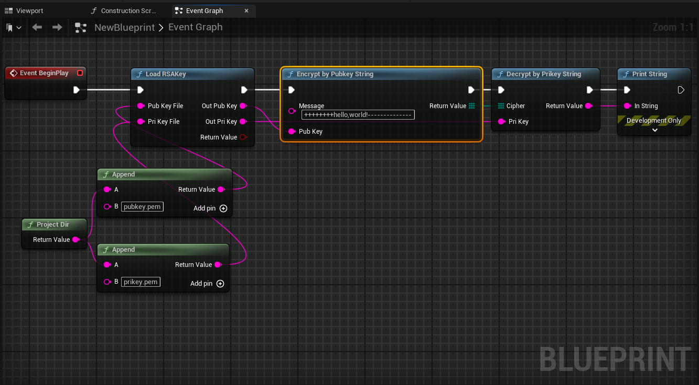
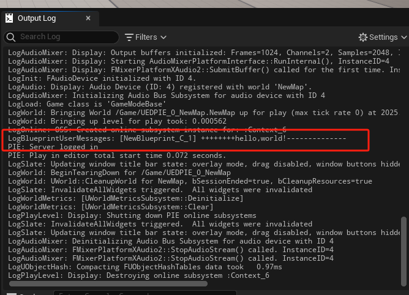
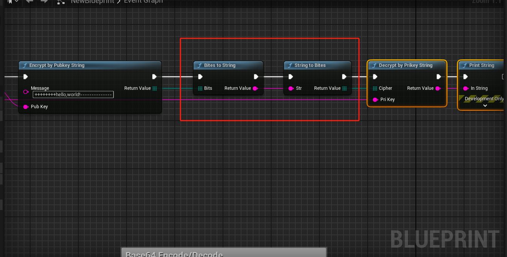

# Introduction to RSA Algorithm

- RSA is a public-key cryptographic algorithm, named after the initials of its three developers: Ron Rivest, Adi Shamir, and Leonard Adleman.
- In asymmetric encryption, there are two keys: a public key and a private key. They form a pair. If a message is encrypted with the public key, only the corresponding private key can decrypt it; if encrypted with the private key, only the corresponding public key can decrypt it.
- The process of exchanging confidential information using asymmetric encryption is as follows: Party A generates a pair of keys and publishes one as the public key. Party B, who obtains the public key, uses it to encrypt the confidential information and sends it to Party A. Party A then decrypts the encrypted information using its private key.

# How to use?

## Generate RSA Key

**Generated public and private key log information**

**Generated encrypted file**

## Load the key file

## Public key encryption + private key decryption

**Print results:**

## Base64 Encode/Decode

These two nodes are to solve the problem of data loss in binary to string conversion

1. **Transmission of Binary Data in Text Protocols**  
   Early communication protocols (such as email) only supported the transmission of ASCII characters and could not directly handle binary data (e.g., images, videos, etc.). Base64 encoding converts binary data into a text format composed solely of ASCII characters, ensuring that the data is not corrupted or lost during transmission.

2. **Compatibility Issues with Special Characters**  
   Certain characters (such as control characters or non-ASCII characters) may be misinterpreted or filtered during transmission, leading to data corruption. Base64 encoding maps binary data to safe printable characters (A-Z, a-z, 0-9, +, /), avoiding this issue.

